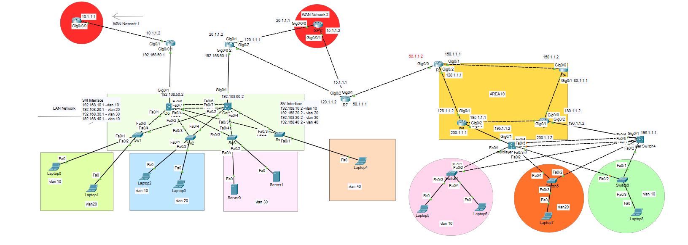

# CCNA Real Lab – Head Office & Branch Office Network Design

## Overview
This project demonstrates a **real-world enterprise networking scenario** where a **Head Office network** is designed and connected to a **Branch Office network** using Cisco routing and switching technologies.

The lab focuses on **network design, configuration, verification, and troubleshooting**, simulating how organisations connect geographically separated offices using WAN links and dynamic routing protocols.

---

## Technologies & Protocols Used
- Cisco Routing & Switching (CCNA level)
- VLANs & Trunking
- Inter-VLAN Routing (SVI)
- OSPF (Internal routing)
- WAN connectivity
- Static & Dynamic routing
- Layer 2 & Layer 3 switching
- Enterprise LAN & WAN design principles

---

## Network Architecture Overview
The network is divided into two major parts:

### 1️⃣ Head Office Network
- Multiple VLANs for departmental segmentation
- Access and distribution switches
- Inter-VLAN routing using SVIs
- End devices connected to access switches
- Internal routing using OSPF

### 2️⃣ Branch Office Network
- Separate VLANs for branch users
- Local access switches
- Routing devices connecting branch to WAN
- OSPF used to exchange routes with head office

### 3️⃣ WAN Connectivity
- WAN links connecting Head Office and Branch Office
- Routing configured to allow end-to-end communication
- Simulated ISP/WAN networks

---

## VLAN Design (Head Office)
| VLAN ID | Purpose | Subnet |
|------|--------|--------|
| VLAN 10 | IT | 192.168.10.0/24 |
| VLAN 20 | HR | 192.168.20.0/24 |
| VLAN 30 | Servers | 192.168.30.0/24 |
| VLAN 40 | Accounts | 192.168.40.0/24 |

Each VLAN uses:
- SVI for Layer 3 routing
- Trunk links between switches
- Proper access port assignments

---

## Implementation Details

### Step 1: LAN Configuration
- VLANs created on switches
- Trunking enabled between switches
- Access ports assigned to correct VLANs
- SVIs configured for inter-VLAN routing

---

### Step 2: Routing Configuration
- OSPF configured for internal routing
- Routes advertised between head office and branch
- WAN interfaces configured for connectivity

---

### Step 3: WAN & Branch Integration
- WAN networks configured between routers
- Branch office connected to head office via routing protocols
- End-to-end routing verified

---

### Step 4: End Device Configuration
- End devices placed in appropriate VLANs
- IP addressing verified
- Default gateways configured using SVIs

---

## Verification & Testing
The network was verified using:
- `ping` between head office and branch devices
- Inter-VLAN communication tests
- OSPF neighbour verification
- Routing table validation
- End-to-end connectivity testing

All devices successfully communicated across VLANs and sites.

---

## Results
- Successful connectivity between head office and branch office
- Inter-VLAN routing functioning correctly
- Dynamic routing established using OSPF
- Enterprise-style LAN/WAN design achieved

---

## Screenshots

### CCNA Real Lab – Head Office & Branch Topology

---

## Key Learnings
- Enterprise network design principles
- VLAN and inter-VLAN routing implementation
- WAN connectivity concepts
- Dynamic routing with OSPF
- Troubleshooting multi-site networks
- Real-world CCNA networking skills

---

## Future Enhancements
- Implement redundancy (HSRP / EtherChannel)
- Add ACLs for traffic filtering
- Enhance security with port security
- Extend to CCNP-level design
